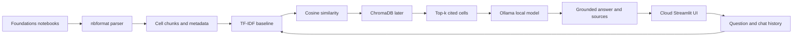

# Cloud ☁️: ML Foundations RAG Assistant

Cloud is a local Streamlit chatbot that answers questions using the notebooks in [`foundations_and_models/`](../../foundations_and_models/) as its knowledge base. It is a practical RAG project for learning how to turn structured technical notes, Markdown explanations, and Python code into a grounded, cited assistant.

Instead of relying on a general-purpose model alone, Cloud retrieves relevant notebook cells first and uses them as the evidence for each answer. The app surfaces those retrieved cells as citations so responses can be checked against the source material.

## Current Status

The Streamlit interface and first working RAG pipeline are ready to run. The application currently uses TF-IDF and cosine similarity as a transparent retrieval baseline, then sends retrieved notebook evidence to Ollama for grounded generation.

## Run Locally

From the repository root:

```bash
cd modern_ml_reponsible_ai/rag_assistant
pip install -r requirements.txt
streamlit run app.py
```

Streamlit will print a local URL, normally `http://localhost:8501`, to open in a browser.

Ollama must also be installed and running locally with the model available:

```bash
ollama pull qwen2.5:7b
```

## Recommended Stack

| Layer                    | Recommendation                                     | Why                                                                        |
| ------------------------ | -------------------------------------------------- | -------------------------------------------------------------------------- |
| UI                       | Streamlit                                          | Keeps the interface simple so the focus stays on the RAG system.           |
| Notebook parsing         | `nbformat`                                       | Reads notebook cells and metadata reliably.                                |
| Chunking                 | Custom Python functions                            | Makes the chunking choices transparent and explainable.                    |
| First retrieval baseline | TF-IDF and`scikit-learn` cosine similarity       | Easy to inspect and debug before adding semantic embedding infrastructure. |
| Later embeddings         | `sentence-transformers` and `all-MiniLM-L6-v2` | A future local semantic retrieval improvement.                             |
| Persistent vector store  | ChromaDB                                           | A future way to persist embeddings and metadata.                           |
| Local generation         | Ollama with`qwen2.5:7b`                          | Runs locally without API keys or per-request costs.                        |
| Optional reranking       | `cross-encoder/ms-marco-MiniLM-L-6-v2`           | A later improvement for ranking close retrieval candidates.                |

The current application uses `nbformat`, TF-IDF, cosine similarity, and Ollama. Sentence-transformers and ChromaDB remain later improvements.

## Sandbox And Application Roles

[`../rag_from_scratch.ipynb`](../rag_from_scratch.ipynb) is the learning sandbox. It walks through the RAG process from the beginning and makes intermediate data visible so you can experiment and understand why each step works.

The sandbox includes:

- notebook parsing with `nbformat`;
- concept and Markdown-plus-code chunk creation;
- TF-IDF vectorization and cosine similarity retrieval;
- manual search experiments and result inspection;
- topic and question-type classification;
- follow-up conversation handling;
- grounded prompt construction;
- Ollama generation and source inspection.

[`rag_engine.py`](rag_engine.py) is the reusable application layer. It contains stable versions of the sandbox functions behind a small interface that Streamlit can call:

```text
Streamlit question
    -> RAGEngine.query(...)
    -> index notebooks if needed
    -> retrieve relevant chunks
    -> build grounded prompt
    -> call Ollama
    -> return answer, topic, and sources
```

The engine stores notebook chunks, vectorizer state, and vectors on the `RAGEngine` instance. The UI does not need to know how those objects are created; it only consumes the returned response.

## What The App Does Not Use Directly

The sandbox contains more instructional and exploratory material than the application needs at runtime. These parts are intentionally not copied directly into the app:

- **Explanatory Markdown:** Notebook cells explaining RAG concepts teach the process but are not executed by Streamlit.
- **Debugging prints:** The sandbox prints records, chunk counts, similarity scores, prompts, and sample outputs for learning. The app stores and displays only user-relevant results.
- **Manual example queries:** The sandbox uses fixed queries for experiments. The engine receives live user questions through `query()`.
- **Notebook-only variables:** Names such as `notebook_cells`, `concept_chunks`, `implementation_chunks`, `all_chunks`, and `chunk_vectors` become instance state inside `RAGEngine`.
- **The Phase 4 demo conversation:** The notebook creates a sample `deque`; the app passes real Streamlit chat history into the engine instead.
- **Manual prompt inspection:** The sandbox exposes the prompt so you can study it. The engine builds and sends it internally to Ollama.
- **Evaluation experiments:** The sandbox plan describes evaluation, but the app does not yet include a formal evaluation suite.
- **Persistence:** The current engine rebuilds an in-memory TF-IDF index when needed. ChromaDB has not been added yet.

This separation is deliberate:

```text
rag_from_scratch.ipynb = learning, experimentation, and inspection
rag_engine.py          = reusable application logic
app.py                 = Streamlit interaction and presentation
```

## Response Contract

The UI receives a predictable response from `RAGEngine.query()`:

```python
{
    "answer": "Grounded response from Ollama.",
    "sources": [
        {
            "notebook": "preprocessing.ipynb",
            "chunk_type": "concept",
            "content": "...",
            "score": 0.91
        }
    ],
    "topic": "preprocessing",
    "question_type": "clarification"
}
```

This allows the UI to display the answer, the retrieved source notebooks, similarity scores, and Cloud's current topic/question-type interpretation without knowing how retrieval or generation works internally.

## Evaluation Plan

Create a small evaluation set of roughly 15 to 25 questions. Include direct lookups, conceptual questions, code questions, follow-up questions, and questions the notebooks cannot answer.

For each question, record the expected notebook and cell, then measure:

- **Retrieval hit rate:** whether expected evidence appears in the top-$k$ retrieved chunks.
- **Groundedness:** whether the generated response stays within the retrieved evidence.
- **Citation correctness:** whether a displayed citation points to the relevant notebook cell.
- **Follow-up continuity:** whether clarification questions retain the prior topic.
- **Latency:** time spent on indexing, retrieval, and generation.

This lets you improve retrieval before blaming the language model for an incorrect answer.

## Architecture



## Deliberate Non-Goals, Initially

- Do not add LangChain or LlamaIndex before you understand the direct implementation.
- Do not use a hosted vector database for this small, local notebook corpus.
- Do not fine-tune a model; chunk quality and retrieval evaluation are the higher-value work here.
- Do not spend more time on custom frontend code. The Streamlit UI is already enough to exercise the system.
